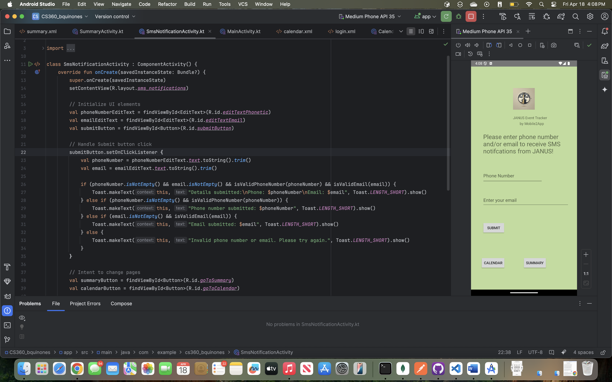
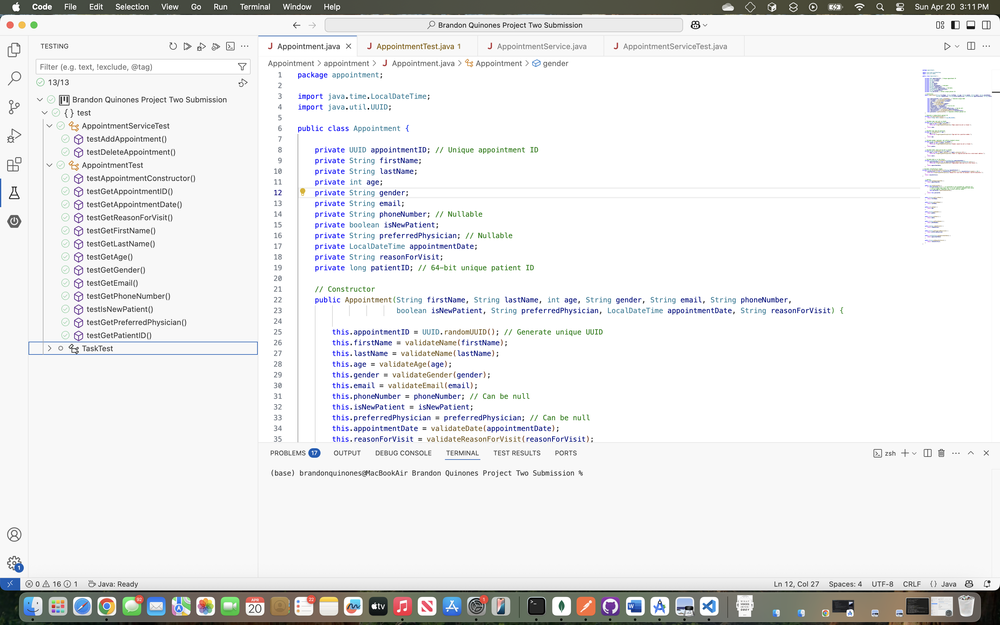
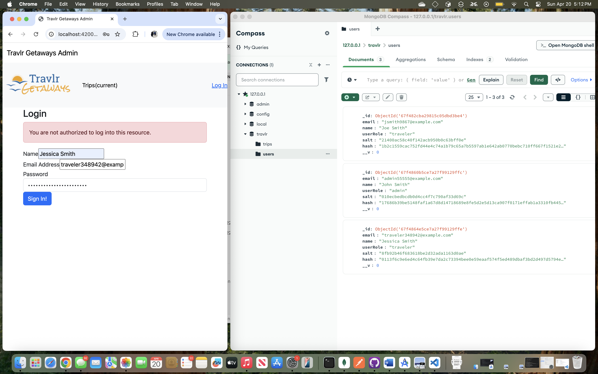

## Welcome

Welcome to my ePortfolio, a reflection of my journey at Southern New Hampshire University and the practical skills I've developed during my capstone course. In this project, I revisited three existing works and enhanced each one with a distinct focus on key areas of computer science. This portfolio is designed with a professional standard in mind, showcasing my ability to present content and data in a clear, effective, and audience-friendly manner.

## Code Review Video

In this code review video, I walk through the three projects I selected for enhancement and explain the changes I made to each. I conduct a standard code review—similar to what typically occurs between a developer and a peer or lead—where code changes are examined collaboratively. Code reviews are a vital part of professional development workflows, ensuring that code quality standards are upheld and that potential issues or oversights are identified early. This collaborative process not only improves the final product but also builds team confidence and accountability, as changes are reviewed and approved by multiple developers before being finalized.

## Enhancement One: Mobile Application UI and Validation

This enhancement focuses on an Android application developed using Java and Kotlin in Android Studio. The project originates from the course **CS-360: Mobile Architecture and Programming**. The app, named **Janus**—after the Roman god of beginnings and endings—is designed to function as an event tracker.

For this enhancement, I implemented a user interface for SMS and email notifications. My goal was to demonstrate proficiency in building a UI in Android Studio while also incorporating backend logic to validate user input. Specifically, the app now checks for valid phone numbers and email addresses before proceeding.

Below, you’ll see the updated layout as well as examples of the validation error messages that are displayed when invalid input is detected.

## Enhancement Two: JUnit Testing and Validation

This enhancement centers around **JUnit** testing, stemming from the course **CS-320: Software Testing, Automation, and Quality Assurance**. The course emphasized understanding data structures and developing JUnit test cases to validate their functionality.

For this enhancement, I focused on the Appointment class, significantly expanding it by introducing a variety of attributes—each with unique data types, validation rules, and business logic. The objective was to demonstrate my ability to write thorough unit tests that verify both the correctness and robustness of these features.

Below, you’ll find images showcasing the class attributes, their respective data types, the validation logic applied, as well as the JUnit test cases and their successful execution results.

## Enhancement Three: Role-Based Access Control with MongoDB

This enhancement is focused on **MongoDB** and stems from the course **CS-465: Full Stack Development I**, where we developed a full-stack application using the **MEAN stack** (MongoDB, Express, Angular, Node.js).

The application includes an admin-focused single-page application (SPA) that enables administrators to add new trips or modify existing ones through a user-friendly interface. For this enhancement, I implemented **role-based access control (RBAC)** by adding logic to the user database to store a userRole field, which defines the permissions associated with each user.

As part of this enhancement, only users with the admin role are now able to log into the admin SPA. This ensures that sensitive administrative features are restricted and secure, highlighting my understanding of authentication, authorization, and secure backend logic.

## Professional Self-Assessment

Reflecting on this course, I feel proud of the skills I’ve demonstrated and the growth I’ve achieved through each project. I was able to apply my knowledge in meaningful ways and strengthen my abilities in real-world development scenarios.

One key area where I see strong potential for myself is in database work. I found myself genuinely engaged when working with MongoDB and user roles, and I’m motivated to further develop my expertise in database management and optimization. It's an area I want to proactively pursue and eventually master.

I also thoroughly enjoy testing and quality assurance, which aligns with my current role as an SDET. I understand the critical role that testing plays in software development, and I take pride in writing thorough, reliable tests that help ensure a solid final product.

On the other hand, I found mobile application development to be more challenging. While I was able to successfully implement the required features and demonstrate the necessary technical skills, the creative aspects—particularly UI and UX design—are less intuitive for me. Designing visually appealing and user-friendly interfaces doesn’t come as naturally, and it's an area where I recognize room for growth, even if it’s not where I see myself specializing.

Looking ahead, my long-term goal is to become a developer and eventually move into leadership roles such as a lead developer or product owner. While I enjoy the technical side of software development, I believe I also have the potential for leadership and team guidance. With experience and continuous skill-building, I hope to one day step into a role where I can contribute both technically and strategically, helping shape projects and mentor others along the way.

## Conclusion

My time at SNHU has been a truly rewarding experience. The flexibility of the online campus allowed me to balance full-time work while completing my degree, and I’m proud of the dedication and perseverance it took to achieve this milestone. This journey has been a significant stepping stone in my career, and I’m excited to see what’s next for me in the field of Computer Science.

Thank you for taking the time to view my ePortfolio—and please feel free to connect with me on <a href="https://www.linkedin.com/in/brandonquinones/" title="LinkedIn" class="btn btn-linkedin btn-lg"><i class="fa fa-linkedin fa-fw"></i> LinkedIn</a>!